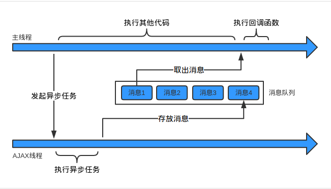

### eventloop简介

[好文](https://segmentfault.com/a/1190000004322358)
直接上图。简单粗暴。

eventloop的意思是事件循环，因为是事件驱动，然后触发事件后产生消息，这里消息指的就是发起异步任务时的回调函数，将消息放到消息队列，然后在主线程执行完当前执行栈的所有同步代码后，就会到消息队列取出这条消息并消费，也就是执行回调函数。

<pre>
setImmediate(() => {
    console.log(2);
});
setTimeout(() => {
    console.log(3);
}, 0);
process.nextTick(() => {
    console.log(4);
});
console.log(1);
// 1432
</pre>
解释：

nextTick(callback)是将callback插入消息队列的队首，如果当前有消息正在处理，就会等处理完立刻执行。

setTimeout(callback,delay[,...args])，在delay时间后产生消息，并不一定会在这时间后就执行，因为有主线程的费时任务或nextTick的存在。

setImmediate(callback[,...args])，callback将在所有io事件处理完毕后执行，多次使用会按顺序执行。

所以setimmediate是最后一个，nexttick插队操作是第一个。

不过，如果delay延时时间长，而主线程和nexttick都执行完了，那么setImmediate就会得到空闲期，就会先执行。