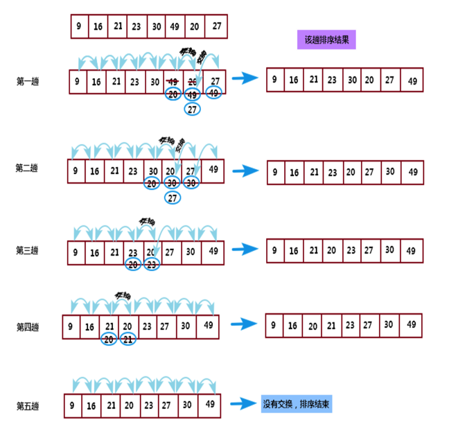

### Object
### Object.keys()，Object.getOwnPropertyNames()
Object.keys方法和Object.getOwnPropertyNames方法很相似，一般用来遍历对象的属性。它们的参数都是一个对象，都返回一个数组，该数组的成员都是对象自身的（而不是继承的）所有属性名。它们的区别在于，Object.keys方法只返回可枚举的属性，Object.getOwnPropertyNames方法还返回不可枚举的属性名。
### 对象属性相关方法
<pre>
{a:1}
属性名：a
属性描述符：{value:1,writable:true,enumerable:true,configurable:true}
Object.getOwnPropertyDescriptor()：获取某个属性的attributes对象。
Object.defineProperty()：通过attributes对象，定义某个属性。
Object.defineProperties()：通过attributes对象，定义多个属性。
Object.getOwnPropertyNames()：返回直接定义在某个对象上面的全部属性的名称
</pre>
***
### 对象状态方法
<pre>
Object.preventExtensions()：防止对象扩展。
Object.isExtensible()：判断对象是否可扩展。
Object.seal()：禁止对象配置。
Object.isSealed()：判断一个对象是否可配置。
Object.freeze()：冻结一个对象。
Object.isFrozen()：判断一个对象是否被冻结。
</pre>
***
### 原型方法
Object.create()：该方法可以指定原型对象和属性，返回一个新的对象。
Object.getPrototypeOf()：获取对象的Prototype对象。
***
### 对象实例方法
<pre>
valueOf()：返回当前对象对应的值。自动类型转换会调用
toString()：返回当前对象对应的字符串形式。自动类型转换会调用
toLocaleString()：返回当前对象对应的本地字符串形式。
hasOwnProperty()：判断某个属性是否为当前对象自身的属性，还是继承自原型对象的属性。
isPrototypeOf()：判断当前对象是否为另一个对象的原型。
propertyIsEnumerable()：判断某个属性是否可枚举。
</pre>

### slice substring substr

都是从字符串中截取，前两个方法第二个参数是结束位置，最后一个第二个参数是截取个数。

### parseInt(value,[radix]) toString([radix])
parseInt('1010',2)：表示以2将前面的value也就是'1010'里面的数据当成二进制数，然后转换成十进制数，也就是将二进制的1010转换成十进制。value可以是任意类型，但如果不是number的话 可能会是NaN。

value.toString(16)：表示将value转换成16机制字符串数，这个valu的默认进制是十进制而且不是string，也就是将十进制的value转换成16进制后再变成字符串(如果value是string类型的话 原样返回)。

### array.sort(function(a,b){})

数组元素排序。按照冒泡排序规则。

每次放相邻2个元素进去，如果返回值大于0 就交换位置；否则不交换。
<pre>
function(a,b){return a - b}
返回值>0 就是说a>b, 也就是前一个元素大于后一个，交换位置。
到最后就形成了升序；
如果是return b - a,如果>0，就是说后一个元素比前一个大，交换顺序，最后就形成了降序。
</pre>